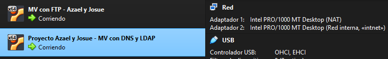
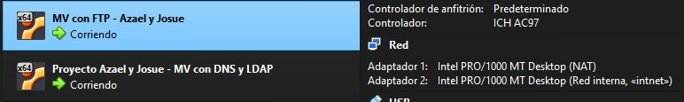

# Guía de Despliegue: Intranet DNS + LDAP + FTP

Esta guía documenta los pasos exactos para reproducir la infraestructura del proyecto en un entorno limpio de Ubuntu Server.

## 0. Configuración de Red (Netplan)
Es crítico establecer las IPs estáticas y el enrutamiento DNS antes de instalar los servicios.

Vamos a tener dos tarjetas de red en cada MV, una nos servirá para tener internet, y la otra será nuestra red interna, con la que nos comunicaremos entre la máquina del DNS y LDAP con la mv del servidor APACHE y FTP.

**MV srv-infra**


**MV srv-web-ftp**


**En `srv-infra` (192.168.100.10):**
```yaml
network:
  version: 2
  ethernets:
    enp0s3:
      dhcp4: true
    enp0s8:
      addresses:
        - 192.168.100.10/24
```

**En `srv-web-ftp` (192.168.100.20):**
```yaml
network:
  version: 2
  ethernets:
    enp0s3:
      dhcp4: true
    enp0s8:
      addresses:
        - 192.168.100.20/24
      nameservers:
        addresses:
          - 192.168.100.10
        search:
          - centro.local
```
**Importante ejecutar: `sudo netplan apply` en ambas MV para aplicar los cambios de red**

## 1. Servidor de Infraestructura (srv-infra)

### 1.1 DNS (BIND9)

**1. Instalar el servicio:**
```bash
sudo apt update && sudo apt install bind9 bind9utils bind9-doc -y
```
**2. Declarar la zona en /etc/bind/named.conf.local:**
```bash
zone "centro.local" {
    type master;
    file "/etc/bind/db.centro.local";
};
```
**3. Crear el archivo de zona /etc/bind/db.centro.local**
```bash
;
; BIND data file for local loopback interface
;
$TTL	604800
@	IN	SOA	srvinfra.centro.local. root.centro.local. (
			      2		; Serial
			 604800		; Refresh
			  86400		; Retry
			2419200		; Expire
			 604800 )	; Negative Cache TTL
;
@	IN	NS	srvinfra.centro.local.
srvinfra	IN	A	192.168.100.10

; Registros obligatorios del proyecto
ldap	IN	A	192.168.100.10
intranet	IN	A	192.168.100.20
ftp	IN	A	192.168.100.20
```

**4. Reiniciar servicio: `sudo systemctl restart bind9`**

### 1.2 Directorio (OpenLDAP)

**1. Instalar paquetes:**
```bash
sudo apt install slapd ldap-utils -y
```
**2. Reconfigurar el paquete para establecer el Base DN (`dc=centro,dc=local`) y la contraseña de administrador (`password`):**
```bash
sudo dpkg-reconfigure slapd
```
**3. Inyectar la estructura de usuarios y grupos:**
```bash
ldapadd -x -D "cn=admin,dc=centro,dc=local" -W -f carga_inicial.ldif -c
```

## 2. Servidor Apache y FTP (srv-web-ftp)

### 2.1 Servidor Web (Apache2)

**1. Instalar y activar módulos LDAP:**
```bash
sudo apt install apache2 -y
sudo a2enmod ldap authnz_ldap
sudo systemctl restart apache2
```

**2. Crear estructura de directorios:**
```bash
sudo mkdir -p /var/www/intranet/{public,profesores,alumnos}
sudo chown -R www-data:www-data /var/www/intranet
```

**3. Crear y configurar el VirtualHost en /etc/apache2/sites-available/intranet.conf:**
```bash
<VirtualHost *:80>
    ServerName intranet.centro.local
    DocumentRoot /var/www/intranet

    <Directory /var/www/intranet/public>
        Require all granted
    </Directory>

    <Directory /var/www/intranet/profesores>
        AuthType Basic
        AuthName "Acceso Exclusivo Profesores"
        AuthBasicProvider ldap
        AuthLDAPURL "ldap://192.168.100.10/ou=usuarios,dc=centro,dc=local?uid"
        Require ldap-group cn=profesores,ou=grupos,dc=centro,dc=local
    </Directory>

    <Directory /var/www/intranet/alumnos>
        AuthType Basic
        AuthName "Acceso Exclusivo Alumnos"
        AuthBasicProvider ldap
        AuthLDAPURL "ldap://192.168.100.10/ou=usuarios,dc=centro,dc=local?uid"
        Require ldap-group cn=alumnos,ou=grupos,dc=centro,dc=local
    </Directory>
</VirtualHost>
```

**4. Activar el sitio web:**
```bash
sudo a2ensite intranet.conf
sudo a2dissite 000-default.conf
sudo systemctl restart apache2
```

### 2.2 Servidor FTP (VSFTPD)

**`(Nota para Josue: Aquí debes documentar los comandos que utilices para instalar vsftpd, crear la carpeta /srv/ftp/publicaciones con sus permisos, y las líneas clave que modifiques en el /etc/vsftpd.conf).`**

## 3. Bonus Extra: Automatización y Hardening (deploy.sh)

Para conseguir un entorno seguro y de producción, hemos creado un script que fortifica el servidor web y despliega reglas de cortafuegos (UFW).

**Pasos para ejecutar el Hardening en `srv-web-ftp`:**

1. Crear el archivo del script:
   `nano deploy.sh`

2. Pegar el siguiente código:
```bash
#!/bin/bash
# ==============================================================================
# Script: deploy.sh
# Descripción: Hardening del servidor web y configuración de Firewall.
# ==============================================================================

echo "🚀 Iniciando Hardening del servidor..."

# 1. HARDENING DE APACHE (Ocultar firmas y deshabilitar listados)
echo "[1/2] Aplicando políticas de seguridad en Apache..."
# Ocultar la versión exacta de Apache y Ubuntu en las respuestas HTTP
sudo sed -i 's/ServerTokens OS/ServerTokens Prod/g' /etc/apache2/conf-available/security.conf
sudo sed -i 's/ServerSignature On/ServerSignature Off/g' /etc/apache2/conf-available/security.conf

# Evitar que se listen los archivos si falta el index.html (Index Listing)
sudo sed -i 's/Options Indexes FollowSymLinks/Options FollowSymLinks/g' /etc/apache2/apache2.conf

# 2. HARDENING DE RED (UFW)
echo "[2/2] Configurando el Firewall perimetral..."
sudo ufw default deny incoming
sudo ufw default allow outgoing
sudo ufw allow 22/tcp comment 'SSH'
sudo ufw allow 80/tcp comment 'HTTP Intranet'
sudo ufw allow 21/tcp comment 'FTP Control'
sudo ufw allow 20/tcp comment 'FTP Datos'
sudo ufw allow 40000:50000/tcp comment 'FTP Puertos Pasivos'

# Activar sin pedir confirmación
sudo ufw --force enable

echo "✅ Reiniciando Apache para aplicar cambios..."
sudo systemctl restart apache2
echo "🛡️ Estado del Firewall:"
sudo ufw status numbered
echo "🎉 ¡Hardening completado!"


3. Dar permisos de ejecución al script:
   `chmod +x deploy.sh`

4. Ejecutar el script:
   `sudo ./deploy.sh`
```